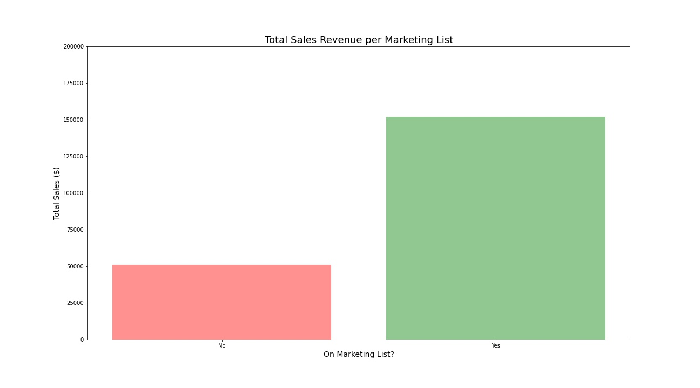

# Marty Stouffer Wildlife Art Gallery

(Actual sales data used; names have been changed to protect confidentiality)

### Gross Sales Revenues by State (Q1 2021)

Key Points:

- Cleaned orders CSV removed 45 orders from Australia/Canada/Fiji/Great Britain totaling $9,831.12 (4.83% of period sales).
- Cleaned orders CSV removed 21 orders that were fully refunded totaling $3,610.69.
- Result is $193,936.50 total period sales analyzed.

### Gross Sales Revenues by Geographic Area (Q1 2021)

### Quartiles, Outliers, and Boxplots (Q1 2021)

Key Points:

- Cleaned marketing CSV removed 21 orders that were fully refunded totaling $3,610.69.
- Result is $203,412.13 total period sales analyzed.

### Total Sales Revenue per Marketing List (Q1 2021)

### Average Sale Revenue per Marketing List (Q1 2021)

